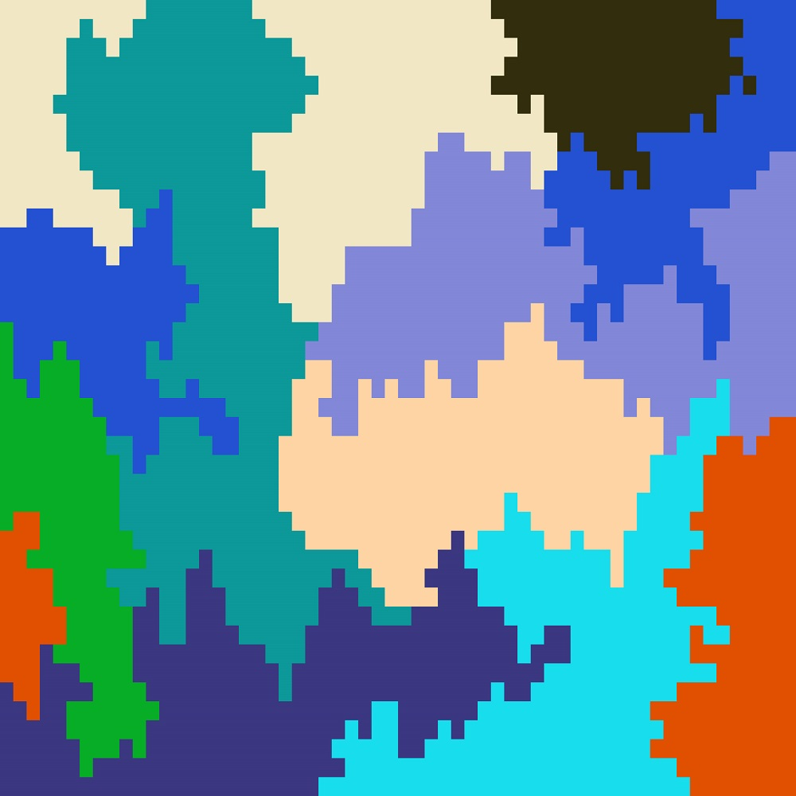

# Project Title
Own World

## Authors
Luan YiTian,
Deng Jianbo, StitchDeng

## Description
The recognition of mankind to the world is explanation to the universe that oneself lives in. So far, I have not been to many places in reality.My own map grows up along with myself, experiencing many changes. My true world starts with a city.
  
The data from GPS that everyone uses, based on Google Map, every geographic area map is divided into pixels, each person's location is one pixel and different people have different colors. As time moves forward and life cycle of people changes,the picture changes. The picture is refreshing all the time with periodical data gathering and every single person has his own changing picture，and showing the different shapes and colors.   
  
The work is completed by joint efforts of artists, program developers and users. Like creating a painting, artists design the style, developers sketch the profile, and finally, users fill the painting with color.

## Link to Prototype



## Example Code
```

```
## Links to External Libraries

## Images & Videos


